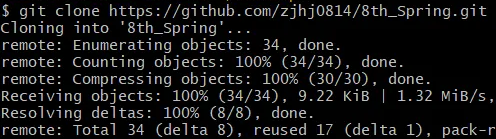

# 미션
### 1. 너디너리 홈페이지 접속하는 과정 적어보기 (소켓프로그래밍과 같은 개념 없이 TCP, IP, PORT 등의 개념 등 오늘 배운 내용으로 간단하게 적어주세요)
1. 사용자가 너디너리 도메인을 검색합니다.
2. 사용자 디바이스에서 TCP 5계층 → 1계층을 지나오며 IP 주소, PORT 번호 등 너디너리 서버의 정보를 포함한 패킷을 생성합니다.
3. 네트워크 연결망을 통해 만들어진 패킷을 전송합니다. (Network Edge → Access Network → Network Core → Access Network → Network Edge)
4. 너디너리 서버에 패킷이 도착하고 TCP 1계층 → 5계층을 지나오며 사용자 요청 데이터를 얻습니다.
5. 사용자가 너디너리 홈페이지 정보를 요청했으므로, Web Server에서 정적 페이지나 WAS에서 동적 페이지를 포함한 응답 패킷을 생성합니다.
6. 네트워크 연결망을 통해 만들어진 패킷을 전송합니다. (Network Edge → Access Network → Network Core → Access Network → Network Edge)
7. 사용자가 패킷을 수신하고 이를 웹 브라우저에 렌더링합니다.

### 2.깃허브 clone 받아서 실행하고 나온 페이지 스크린 샷 찍기
