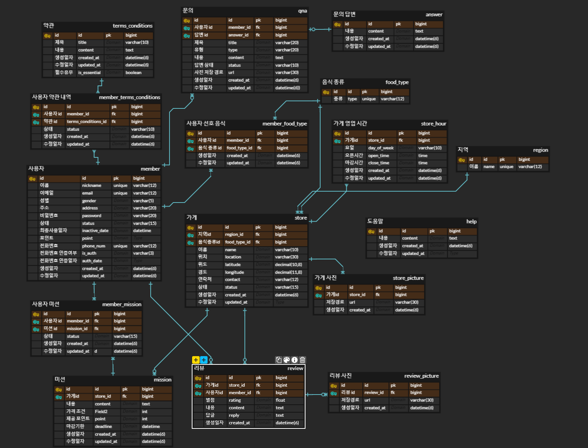

# 미션
## 1주차 때 설계한 데이터베이스를 토대로 아래의 화면에 대한 쿼리를 작성

### 1. 내가 진행중, 진행 완료한 미션 모아서 보는 쿼리(페이징 포함)
+ 사용자 미션 생성시간 DESC, 미션 id DESC 정렬

[ 첫 번째 요청 ]

사용자는 사용자 id와 조회하고자하는 미션 상태를 포함하여 데이터를 요청한다고 가정한다.
```mysql
SELECT m.id, m.contnet, m.point, mm.status, s.name
FROM mission AS m
JOIN member_mission AS mm ON m.id = mm.mission_id
JOIN store AS s ON m.store_id = s.id
WHERE mm.member_id = {member_id} AND mm.status = {member_mission_status}
ORDER BY mm.created_at DESC, m.id DESC
LIMIT 15;
```
[ 첫 번째 요청 이후 ]

사용자는 사용자 id와 조회하고자하는 미션 상태뿐만 아니라
cusor의 미션 id를 포함하여 데이터를 요청한다고 가정한다.
```mysql
SELECT m.id, m.contnet, m.point, mm.status, s.name, CONCAT(LPAD(DATE_FORMAT(mm.created_at,'%Y%m%d%H%i%s'), 20, '0'), LPAD(m.id, 10, '0')) AS cursor_value
FROM mission AS m
JOIN member_mission AS mm ON m.id = mm.mission_id
JOIN store AS s ON m.store_id = s.id
WHERE mm.member_id = {member_id} AND mm.status = {member_mission_status}
  AND CONCAT(LPAD(DATE_FORMAT(mm.created_at,'%Y%m%d%H%i%s'), 20, '0'), LPAD(m.id, 10, '0')) <
      ( SELECT CONCAT(LPAD(DATE_FORMAT(mm_sub.created_at,'%Y%m%d%H%i%s'), 20, '0'), LPAD(mm_sub.mission_id, 10, '0'))
        FROM member_mission AS mm_sub WHERE mm_sub.member_id = {member_id} AND mm_sub.mission_id = {mission_id} )
ORDER BY mm.creadted_at DESC, m.id DESC
LIMIT 15;
```
### 2. 리뷰 작성하는 쿼리(사진의 경우 일단 배제)
> 💡 review 테이블을 만들 때, review_id를 AUTO_INCREMENT로, reply 디폴트 값을 NULL로 설정했다고 가정한다.
```mysql
INSERT INTO review (store_id, member_id, rating, content, created_at) VALUES ({store_id}, {member_id}, {rating}, {content}, {created_at});

-- INSERT INTO review (store_id, member_id, rating, content, created_at) VALUES (1, 1, 5, '음 너무 맛있어요', NOW());
```
### 3. 홈 화면 쿼리(현재 선택된 지역에서 도전이 가능한 미션 목록, 페이징 포함)
+ 미션 데드라인 ASC, 미션 id ASC
> 💡 미션이 생길 때마다 모든 사용자가 사용자 미션 값을 '도전 가능' 상태로 INSERT 하는 것은 디스크 낭비라고 생각해서
> 
> 사용자가 미션도전!을 클릭해야 사용자 미션 값이 INSERT 된다고 설계한다.
> 
> ~~피드백 아주 잘 받습니다!!~~

[ 첫 번째 요청 ]

사용자는 사용자 id와 지역 id를 포함하여 데이터를 요청한다고 가정한다.
```mysql
SELECT m.id, m.store_id, m.content, m.price_term, m.point, m.deadline, s.name
FROM store AS s
JOIN mission AS m ON s.id = m.store_id
WHERE s.region_id = {region_id}
  AND m.deadline > now()
  AND m.id NOT IN
    ( SELECT mission_id
    FROM member_mission
    WHERE member_id = {member_id} )
ORDER BY m.deadline ASC, m.id ASC
LIMIT 5;
```

[ 첫 번째 요청 이후 ]

사용자는 사용자 id와 지역 id 뿐만 아니라 
미션 id를 포함하여 데이터를 요청한다고 가정한다.
```mysql
SELECT m.id, m.store_id, m.content, m.price_term, m.point, m.deadline, s.name, CONCAT(LPAD(DATE_FORMAT(m.deadline,'%Y%m%d%H%i%s'), 20, '0'), LPAD(m.id, 10, '0')) AS cursor_value
FROM store AS s 
JOIN mission AS m ON s.id = m.store_id
WHERE s.region_id = {region_id} 
  AND m.deadline > now()
  AND m.id NOT IN
    ( SELECT mission_id
    FROM member_mission
    WHERE member_id = {member_id} )
  AND CONCAT(LPAD(DATE_FORMAT(m.deadline,'%Y%m%d%H%i%s'), 20, '0'), LPAD(m.id, 10, '0')) < 
	( SELECT CONCAT(LPAD(DATE_FORMAT(m.deadline,'%Y%m%d%H%i%s'), 20, '0'), LPAD(m.id, 10, '0'))
	FROM mission AS m_sub 
	WHERE m_sub.id = {mission_id} )
ORDER BY m.deadline ASC, m.id ASC
LIMIT 5;
```
> `UNIX_TIMESTAMP`: 날짜 인수 값을 1970-01-01 00:00:00 UTC 이후 초 단위로 반환
### 4. 마이 페이지 화면 쿼리
```mysql
SELECT m.id, m.nickname, m.email, m.point,
    CASE 
           WHEN m.is_auth = 'Y' THEN m.phone_num
            ELSE '미인증'
    END AS phone_num
FROM member AS m WHERE id = {member_id};
```