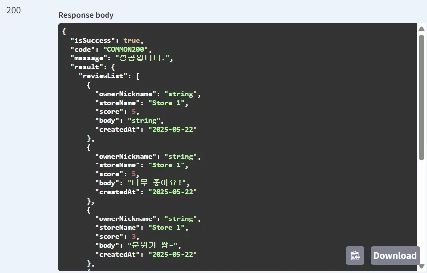
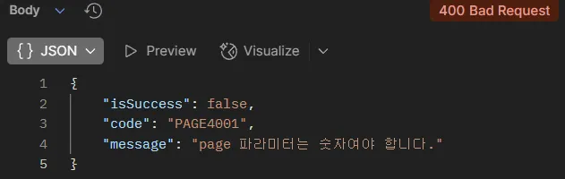
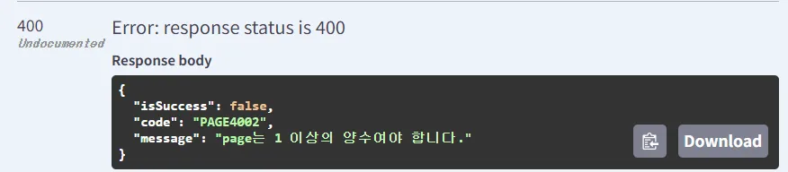
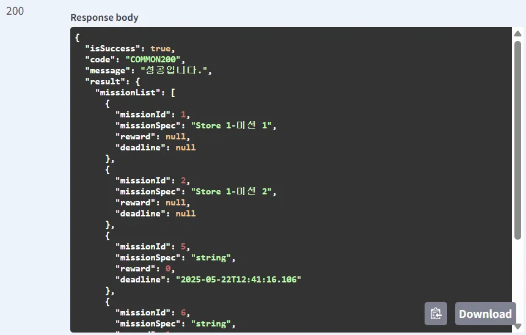
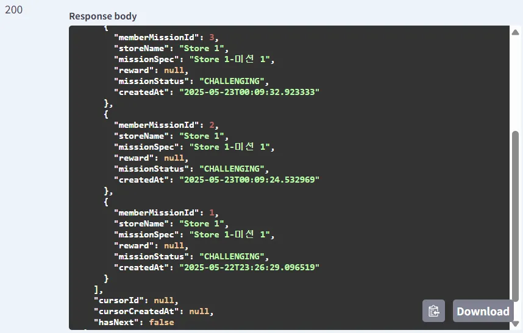

## 미션
```text
**API 구현 조건**

1. 반드시 Paging처리를 할 것,
   한 페이지에 10개씩 조회 **프론트엔드는 1 이상의 page 번호를 전달**
2. 필요한 데이터는 데이터베이스에서 직접 삽입을 해서 진행 (미션 외 API는 구현해도 됨)
    1. 다만 미션 외 API는 작성을 해도 구현한 API 갯수로 카운트가 되지 않음
3. 프론트엔드가 주는 page는 **쿼리 스트링**으로 받아오며 이에 대한 처리를 하는 **커스텀 어노테이션 구현**을 반드시 할 것
    1. 1번의 page 범위에 따라 커스텀 어노테이션은 page 1을 0으로 만들어 return 해야 한다.
    2. 그와 동시에 **page의 범위가 너무 작은지 (0 이하)** 판단을 하여 작은 경우 에러를 발생
    3. 에러 발생 시 반드시 **RestControllerAdvice와 연계**를 해야 함
4. 반드시 모든 API에 대해 **Swagger 명세**를 해야 한다.
5. Converter에서 절대로 for문을 사용해서는 안되며, 무조건 **Java의 Stream**을 사용해야 한다.
6. 무조건 **빌더 패턴**을 사용해야 한다.
7. API 구현
```
### 1. 내가 작성한 리뷰 목록

### 2. 특정 가게의 미션 목록

### 3. 내가 진행중인 미션 목록
